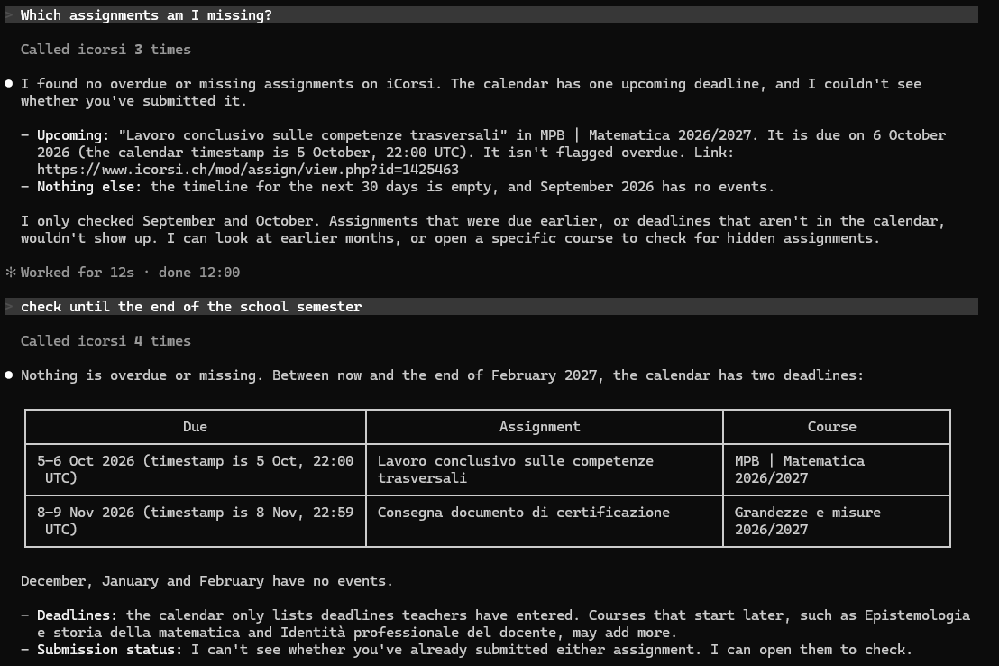

# icorsi-mcp

An unofficial API and [MCP](https://modelcontextprotocol.io) server for [iCorsi](https://www.icorsi.ch), the Moodle platform used by USI and SUPSI. It lets an AI assistant such as Claude read your courses, deadlines, forum posts and files, and download course material for you.



> This project is not affiliated with or endorsed by USI, SUPSI or iCorsi. It works by talking to the same endpoints your browser uses, so it may break when the site changes. Use it with your own account only.

## What it can do

- **Dashboard**: who you are, your enrolled courses, upcoming deadlines.
- **Calendar**: events and deadlines for any month.
- **Course contents**: sections and activities of a course.
- **Deep activity view**: page text, files, external links, assignment dates and submission status, forum discussions with every post and attachment.
- **What's new**: a deep scan of all your courses that reports anything added since the previous scan.
- **Find**: search by name across everything inside your courses, including files inside folders and forum posts.
- **Catalogue search**: search all iCorsi courses, not only the ones you are enrolled in.
- **Downloads**: save a single file, or a whole folder as a zip, to your disk.

## Requirements

- Node.js 18 or later
- An iCorsi account (login goes through Microsoft)

## Install

```
git clone https://github.com/PezzottiCarlo/icorsi-mcp.git
cd icorsi-mcp
npm install
```

`npm install` also downloads the Chromium build that Puppeteer uses for the login.

## Login

iCorsi signs you in through Microsoft, which cannot be done from a terminal. The first time any command needs a session, a browser window opens: complete the Microsoft login there and the window closes by itself.

After that the login is silent. The browser profile is kept in `.profile/` and the session cookies in `.session.json`; when the session expires it is renewed in a headless browser, and a window opens again only if Microsoft asks for your credentials.

To log in ahead of time:

```
npm run cli -- login
```

## Use it with Claude Code

The repository ships a `.mcp.json`, so Claude Code picks the server up when you start it in this folder. Approve the `icorsi` server when asked, then check with `/mcp` that it is connected.

To make it available from any folder, register it for your user:

```
claude mcp add icorsi --scope user -- node /absolute/path/to/icorsi-mcp/src/mcp.js
```

Then just ask, for example:

- "Which assignments am I missing?"
- "What's new on iCorsi since yesterday?"
- "Download the slides of the first lesson of Grandezze e misure."
- "Summarise the latest announcements in my courses."

## Use it with other MCP clients

Any client that supports stdio servers works. For Claude Desktop, add this to `claude_desktop_config.json`:

```json
{
  "mcpServers": {
    "icorsi": {
      "command": "node",
      "args": ["/absolute/path/to/icorsi-mcp/src/mcp.js"]
    }
  }
}
```

## Tools

| Tool | Description |
|---|---|
| `icorsi_home` | Logged-in user, enrolled courses and upcoming deadlines. |
| `icorsi_list_courses` | Enrolled courses with their ids. |
| `icorsi_get_course` | Sections and activities of a course. |
| `icorsi_get_activity` | Everything inside one activity: text, files, links, assignment status, forum discussions and posts. |
| `icorsi_search_courses` | Search the whole iCorsi course catalogue. |
| `icorsi_calendar` | Calendar events of a month. |
| `icorsi_new_content` | Deep scan of the enrolled courses; returns what is new since the previous scan. |
| `icorsi_find` | Search activities, files, links, discussions and posts across all enrolled courses. |
| `icorsi_download` | Download a file, or a folder as zip, and return its local path. |
| `icorsi_login` | Force a new login. |

## How the deep scan works

`icorsi_new_content` opens every activity of every enrolled course and collects the activities themselves, the files (also inside folders and forum posts), the external links, and the forum discussions and posts. The result is stored in `.state/index.json`, and the next scan reports only what was not there before.

- The first scan of a course only records a baseline and reports nothing new.
- A full scan takes about a minute for a handful of courses.
- `icorsi_find` searches this index, so run a scan first if you need fresh results.
- The scan opens activities the way a browser does, so Moodle may mark them as viewed and trigger view-based completion.
- Third-party activity types (board, Wooclap, H5P, feedback) are detected, but their inner content is not read.

## Downloads

Files are saved in `downloads/` inside the project. Set the `ICORSI_DOWNLOAD_DIR` environment variable to change the default, or pass `dir` to the tool. Only `www.icorsi.ch` URLs are accepted.

## Command line

Every feature is also available without an AI client:

```
npm run cli -- home
npm run cli -- courses
npm run cli -- course <id>
npm run cli -- activity <url>
npm run cli -- search <query>
npm run cli -- calendar [year] [month]
npm run cli -- event <id>
npm run cli -- new [--dry]
npm run cli -- find <query>
npm run cli -- download <url> [dir]
```

## Use it as a library

```js
import { ICorsi } from './src/client.js';

const icorsi = new ICorsi();
const { user, courses, timeline } = await icorsi.getHome();
const news = await icorsi.findNewContent();
const file = await icorsi.download(news[0].newItems[0].url);
```

`icorsi.ajax(methodname, args)` calls any Moodle AJAX web service function directly.

## Project layout

| File | Purpose |
|---|---|
| `src/mcp.js` | MCP server (stdio). |
| `src/client.js` | The `ICorsi` client: session handling and all API methods. |
| `src/auth.js` | Microsoft login through Puppeteer. |
| `src/parse.js` | HTML parsing of activity and course pages. |
| `src/cli.js` | Command-line interface. |
| `src/record.js` | Traffic recorder used to reverse-engineer the site. |

## Recording traffic

To add support for something new, record what the browser does:

```
npm run record
```

A browser opens on iCorsi; browse the feature you want to cover, then press Ctrl+C. Every request, response body, header, cookie, page snapshot and screenshot is saved under `captures/<timestamp>/`.

## Privacy

Everything stays on your machine. These folders and files contain your cookies, tokens and personal data; they are git-ignored and should never be shared:

- `.profile/` and `.session.json`: your login
- `.state/`: the index of your course contents
- `captures/`: recorded traffic
- `downloads/`: downloaded files
